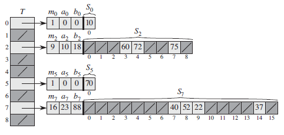

## 发生Hash冲突解决方法
[解决hash冲突的三个方法](https://www.cnblogs.com/wuchaodzxx/p/7396599.html)
### 开放定址法（再散列法）

当以key为关键字的哈希地址p = H(key)出现冲突时，以p为基础，产生另一个哈希地址p1,如果p1冲突，再以p为基础，产生另一个p2，直到不冲突,
一般有一个通用的再散列形式
```
hi = (H(key) + di) % m
i = 1, 2, ...
m 为哈希表长
H(key) 为哈希函数
di 为增量序列 
```

根据增量序列的不同
相应的再散列方式主要分为以下三种
+ 线性探测再散列 di = 1, 2, 3, ..., n
  特点：
  + 处理溢出需另编写程序，一般设立一个溢出表，溢出表一般为顺序表
  + 冲突发生时，顺序查找表中下一单元，直达找到空单元或者找到相应元素或者查遍全表
  + 删除困难，删除一个元素时，查找其他元素时可能会找到空槽，则会认为需要查找的元素不存在，只能标记被删除的元素，不然会影响以后的查找
  + 容易聚集，记录在表中连成一片，堆聚出现就引起进一步堆聚
+ 二次探测再散列 di = 1^2, -1^2, 2^2, -2^2, ..., n^2, -n^2
+ 伪随机探测再散列 di = 伪随机数序列
+ 双散列h(i, k) = (h1(k) + i * h2(k)) % m, 不易产生聚集但计算时间增加

散列表的载荷因子定义为： 
$\alpha=$ 填入表中的元素个数 / 散列表的长度，实际上，散列表的平均查找长度是载荷因子$\alpha=$的函数，只是不同处理冲突的方法有不同的函数。


### 拉链法
将哈希值相同的元素形成一个单链表，单链表的表头存在哈希表中，适合经常插入删除的情况
缺点：指针需要额外的空间

### Two-way Chaining
Two-way Chaining 就像是 Double hashing，区别在于 Double hashing 使用一个哈希表，而 Two-way Chaining 使用两个哈希表 T1和 T2。在插入时，T[h1(x)] 和 T[h2(x)] 中哪个装载的元素更少，就插入到哪儿。查找时需要访问两个哈希表

### 建立公共溢出区
将哈希表分为基本表和溢出表两部分，凡是和基本表发生冲突的元素，一律填入溢出表

### 完美哈希函数PHF
当关键字是不变的静态集合时  
[完美哈希](https://www.cnblogs.com/gaochundong/p/hashtable_and_perfect_hashing.html)  
[gperf是一个完美的哈希函数生成器](http://www.gnu.org/software/gperf/)  
第一次Hash到m个桶，每个桶中另一个Hash表，其中桶中空槽的个数等于桶中元素个数的平方
   
[构造保序最小完美哈希函数](https://blog.csdn.net/tiankong_/article/details/76789076)  
TODO：  
[动态完美哈希Wiki](https://en.wikipedia.org/wiki/Dynamic_perfect_hashing#FKS_Scheme)   
[动态完美哈希Github](https://github.com/LawrenceZhou/Dynamic-Perfect-Hash-for-Linux-XIA)    
### 总结
结点规模较小时，适合开放地址法  
拉链法更适合于造表前无法确定表长的情况，可以做到**装填因子**大于1，当结点规模大时，指针域可以忽略不计，因此更节省空间
unorder_map采用拉链法
