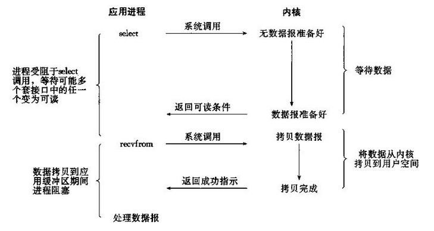

### 同步阻塞IO  
每个进程/线程只能处理一个流, 1次调用1次返回，当有多个流时采用多线程或者多进程效率都不太理想
```py
i.isReady()
read(i)
```
### 同步非阻塞IO  
多个流采用**忙**轮询，不断询问，如果所有的流都没有准备好，CPU一直空转，就白白浪费了CPU
```py
while(True):
    for i in  range(n):
        if i.isReady():
            read(i)
```    

### IO复用   
**IO多路复用其实复用的是一个线程，多个描述符的I/O操作都能在一个线程内并发交替地顺序完成**  
  
select问题:
+ 最大并发数限制1024，改变需要重新编译内核
+ 效率问题O(n) 
+ 每次调用select都要拷贝将fd到内核
  
poll:  
+ 链表实现

epoll:
+ 没有描述符的限制
+ 采用回调的方式，epoll只管活跃的事件，只有活跃的fd才会进行回调
+ 水平触发：默认工作模式，即当epoll_wait检测到某描述符事件就绪并通知应用程序时，应用程序可以不立即处理该事件；下次调用epoll_wait时，会再次通知此事件。
+ 边缘触发：当epoll_wait检测到某描述符事件就绪并通知应用程序时，应用程序必须立即处理该事件。如果不处理，下次调用epoll_wait时，不会再次通知此事件

  
在Linux的缓存I/O机制中，操作系统会将I/O的数据缓存在文件系统的页缓存中，即数据会先被拷贝到操作系统内核的缓冲区中，然后才会从操作系统内核的缓冲区拷贝到应用程序的地址空间。  
无论是select,poll还是epoll都需要内核把FD消息通知给用户空间，如何避免不必要的内存拷贝就很重要，在这点上，epoll是通过内核与用户空间mmap同一块内存实现的,epoll的解决方案在epoll_ctl函数中。每次注册新的事件到epoll句柄中时（在epoll_ctl中指定EPOLL_CTL_ADD），会把所有的fd拷贝进内核，而不是在epoll_wait的时候重复拷贝  
[epoll代码](http://blog.lucode.net/linux/epoll-tutorial.html)
### 信号驱动
IO准备好时发送SIGIO信号，在程序中绑定信号处理函数即可

### 异步非阻塞
调用aio_read()立即返回，内核直接复制数据给进程
### Reactor模式  
[Reactor模式1](https://www.cnblogs.com/ivaneye/p/5731432.html)  
[Reactor模式2](https://www.cnblogs.com/doit8791/p/7461479.html)  
[Reactor模式3](http://www.cnblogs.com/fxjwind/p/3363329.html)  
