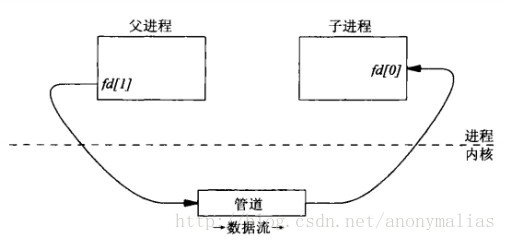

### 进程间通信方式IPC
#### 管道Pipe
管道可用于具有亲缘（父子）关系进程间的通信
一个管道只能支持亲缘进程间的单向通信即半双工通信
```c
#include <unistd.h>
int pipe(int filedes[2]);
                       //成功返回0，失败返回-1
```
  
#### FIFO(有名管道Named Pipe )
FIFO最大的特性就是每个FIFO都有一个路径名与之相关联，从而允许无亲缘关系的任意两个进程间通过FIFO进行通信。
```c
#include <sys/types.h>
#include <sys/stat.h>
 
int mkfifo(const char *pathname, mode_t mode); //成功则返回0，失败返回-1
          // 管道名
```
#### 信号
信号是比较复杂的通信方式，用于通知接受进程有某种事件发生，除了用于进程间通信外，进程还可以发送信号给进程本身
#### 信号量
信号量本质是一个计数器，一般将它当作锁机制，来控制多个进程对共享资源的访问。当多个进程，或者同一进程里的多个线程要对某个资源进行访问时，可使用信号量来实现同步
#### 消息队列
消息队列是由消息的链表，有足够权限的进程可以向队列中添加消息，被赋予读权限的进程则可以读走队列中的消息
消息队列克服了信号传递信息少、管道只能承载无格式字节流以及缓冲区大小受限等缺点

#### 共享内存
是最快的通信方式，用于实现进程间大量的数据传输

#### Socket
可用于不同机器之间的进程间通信