### 左倾红黑树
set,map中的数据结构

### 2-3-4树
+ 2-node：1个键，2个子节点
+ 3-node：2个键，3个子节点
+ 4-node：3个键，4个子节点  
  
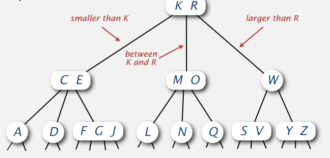  
在2-3-4树中，只有4-node的分裂才会导致树增高1  
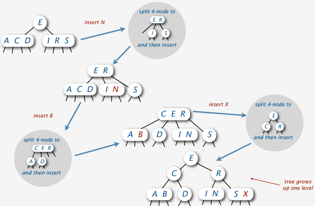  
2-3-4树与红黑树的对应关系  
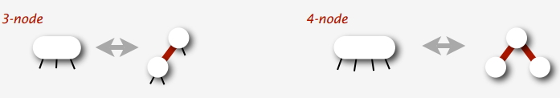  
上下关系的连续两条红边是不存在  
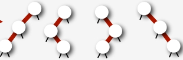   
最终修正为如上的标准4-node

#### 插入  
插入节点最终插入叶子节点，插入新节点，新节点与父节点的边总是红色的
插入时遇到4-node时**先将4-node转化，向上传递红边，再插入**，4-node的父节点可能重新成为4-node   
但我们仅关注当前节点不再为4-node,所以考虑插入时只用考虑父节点为2-node和3-node情况  
  

+ 2-node  

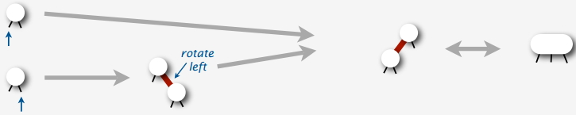
+ 3-node  

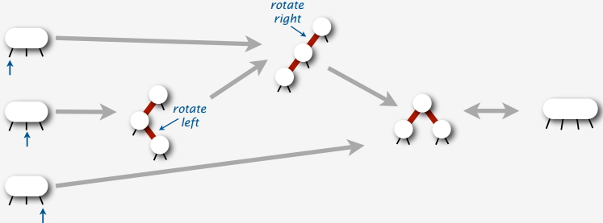

+ 4-node

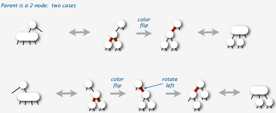  
+ 3-node  

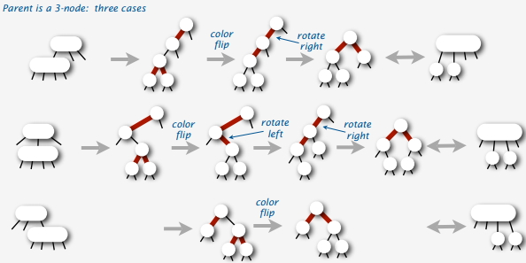

代码如下：  

### 删除
删除任意值需要删除最小值的基础  
为了删除最小值，我们需要   
如果最小值在3-node和4-node可以直接删除，但是如果是2-node，删除则会影响父节点定义  
如果维持在任意节点h或者h->left为黑链  
这样当我们删除最小值时可以直接删除，因为最后一个肯定是红边(h->left为空黑边)  
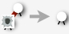  

当h.left和h.left.left为黑边时，根据定义h必为红边，为了保证上述性质，分以下两种情况  
删除思路：先从父节点借一个，然后视情况决定兄弟节点该不该往父节点填    
第1种h.right.left为黑，这说明h.right是一个2-node, 可以直接将两个合并，只需要flipcolor(h)即可，这时为4节点  
第2种h.right.left为红，这说明h.right至少是一个3-node, flipcolor(h), 父节点中一个节点往下融合为5-node, 重新划分子节点  
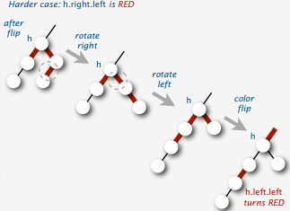  
对应代码为  
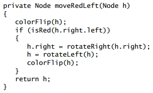  
删除最小值对应代码为  
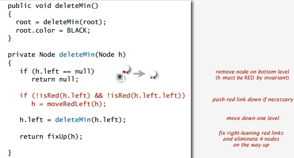  
删除最大值对应代码为  

先要保证删最小值，完整的删除代码为  
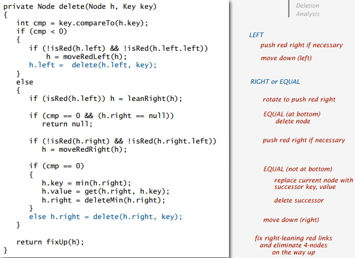  
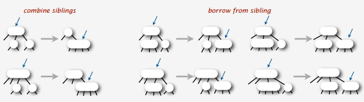

### 参考
[LLRB](pdf/RedBlack.pdf)  
[博客](https://www.cnblogs.com/Leo_wl/p/3367314.html)